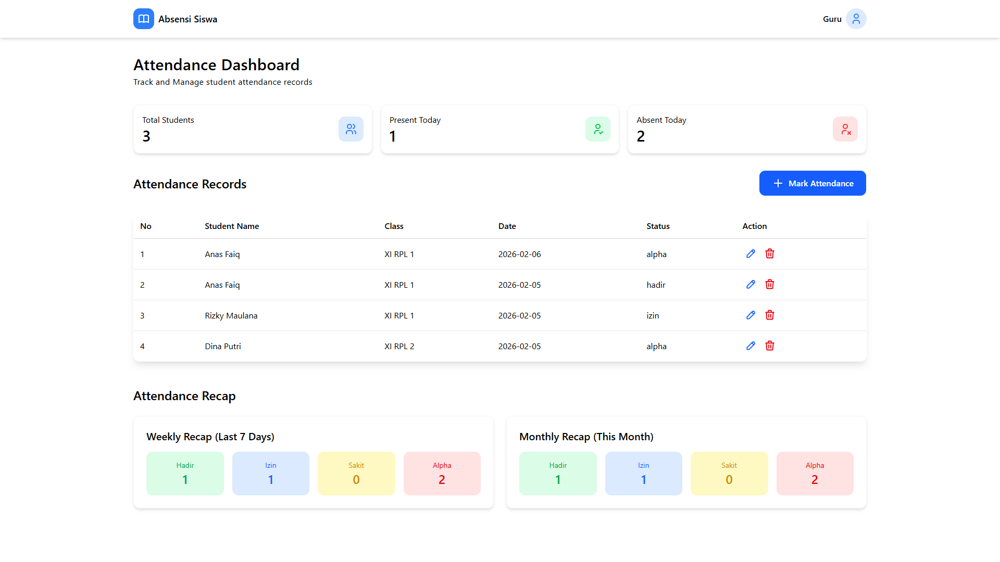
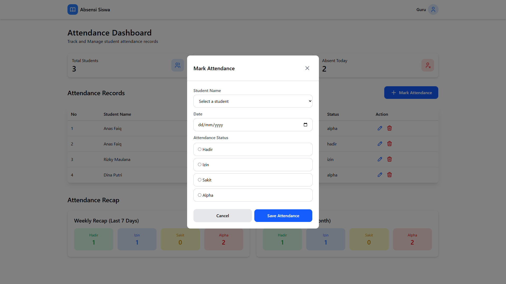

# 📊 Sistem Absensi Siswa

Aplikasi web sederhana untuk mengelola absensi siswa berbasis PHP & MySQL.

## ✨ Fitur Utama
- Dashboard absensi
- Data kehadiran siswa
- Rekap mingguan & bulanan
- Status: Hadir, Izin, Sakit, Alpha

## 🖼️ Tampilan Aplikasi

## 🛠️ Teknologi
- PHP
- MySQL
- HTML, CSS
- Tailwind

## 👨‍🎓 Dibuat oleh
Anas Faiq – XII PPLG
